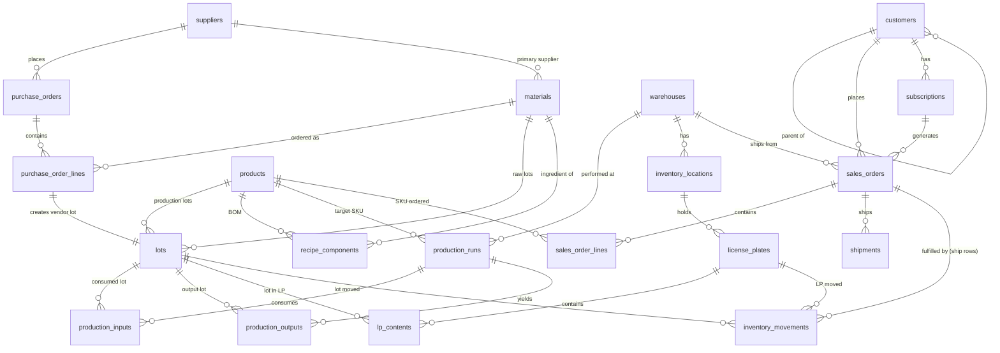

# Data Engineer — Take-Home Assignment

Welcome, and thanks for taking the time to work through this. This exercise is designed to give us a clear, fair look at how you think about data, write SQL, and communicate findings — and to give you a realistic feel for the kind of work you'd do on the team.

**Plan for about 5 hours total.** You may spend more if you want, but please don't feel obligated. We'd much rather see three parts done well than five parts done sloppily — partial submissions are explicitly fine, and we will tell you up front: *finishing everything is not the bar.* What matters is that what you do submit is correct, readable, and honestly described.

If something is genuinely blocking you (the data file won't open, the dev server won't start, a question is ambiguous in a way you can't resolve) — email us. Don't burn an hour stuck.

---

## 1. Setup (~10 minutes)

### What you need

- **DuckDB CLI** — install from [duckdb.org/docs/installation](https://duckdb.org/docs/installation/). Any recent version (1.x) is fine. You can also use the DuckDB Python or Node bindings, or any DBeaver/DataGrip client that speaks DuckDB — whatever you're comfortable with.
- **Node.js 18+** — for Evidence.dev (Part D).
- **A SQL editor** of your choice.

### Getting the data

1. Download the dataset zip (~670 MB): [endeavor_tea_works.duckdb.zip](https://drive.google.com/file/d/1jdqSToAAcLWJsO70d3zOoHJ8OUT8cntd/view?usp=sharing)
2. Unzip. You'll get `endeavor_tea_works.duckdb` (~2.3 GB on disk).
3. Place it somewhere convenient. From here on we'll assume it lives at `./endeavor_tea_works.duckdb`.

### Verify your setup

Open the database and run this query:

```sql
SELECT COUNT(*) AS n_products FROM products;
```

You should get **350**. If you do, you're good to go. If not, see the troubleshooting note at the end of this document.

### Install dependencies and start the dev server

You're already inside the starter repo — this file (`ASSIGNMENT.md`) lives in it. From the repo root:

```bash
npm install
# Place endeavor_tea_works.duckdb in this directory, then:
npm run sources    # one-time: materialize source queries
npm run dev        # start the Evidence dev server
```

Open [http://localhost:3000](http://localhost:3000). You should see a "Hello, Endeavor Tea Works" page. The DuckDB connection is already wired up. You'll edit pages in `pages/` for Part D.

---

## 2. About Endeavor Tea Works

Endeavor Tea Works is a fictional ~$100M specialty tea company. Founded ~2012, headquartered in Portland, Oregon, ~200 employees. They sell loose-leaf, sachet, bagged, and foodservice-format teas across three product lines: **Classics**, **Wellness**, and **Single-Estate Reserve**. Roughly 350 SKUs.

### Channels

- **DTC ecommerce + subscriptions** (~40% of revenue) — direct shoppers on the website, plus tea-of-the-month and refill subscriptions.
- **Wholesale** (~50%) — grocery chains (Whole Foods, regional naturals), specialty cafés, gift retailers. Many wholesale accounts have a parent → ship-to structure (e.g., Whole Foods corporate → individual stores).
- **Foodservice** (~10%) — restaurants, hotels, airlines, corporate cafeterias, routed through foodservice distributors (Sysco, US Foods) in operator-grade bulk formats.

### Footprint

- **Portland, OR** — primary blendery and DC. Receives Asian-origin imports, runs the full production line (blend → pack), fulfills DTC nationwide and West Coast wholesale.
- **Eastern PA** — secondary DC, no production. Receives finished-goods transfers from Portland and fulfills East Coast wholesale.
- **NJ co-packer** — third-party light packaging for foodservice bulk formats.

### Procurement

Endeavor sources from ~30 origin estates and importers globally — India, Sri Lanka, China, Japan, Kenya, Argentina — plus packaging vendors and ingredient vendors (oils, flavorings, dried botanicals).

### Production (two-stage)

1. **Blend** — raw teas, herbs, and botanicals are consumed; intermediate "blend lots" are produced.
2. **Pack** — blends plus packaging materials are combined to produce finished SKUs in target formats.

Lot identity is preserved end-to-end. A vendor lot is received → consumed in a production run → a new production lot is tagged on the finished output → tracked through inventory until shipped.

---

## 3. The data model

Three operational source systems feed the warehouse:

- **WMS/ERP** — procurement, inventory, production, outbound. The spine.
- **Ecom platform** — DTC orders, customers, subscriptions (Shopify-flavored).
- **Production / batch system** — recipes, runs, yields.

For this exercise, you're working with the integrated warehouse layer. Tables are grouped into four domains:

- **Suppliers & Procurement** — `suppliers`, `purchase_orders`, `purchase_order_lines`, `materials`, `lots`
- **Products & Production** — `products`, `recipe_components`, `production_runs`, `production_inputs`, `production_outputs`
- **Inventory** — `warehouses`, `inventory_locations`, `license_plates`, `lp_contents`, `inventory_movements`
- **Customers, Sales, Fulfillment** — `customers`, `subscriptions`, `sales_orders`, `sales_order_lines`, `shipments`, `employees`

### Things you should know

A few design decisions in the warehouse that will save you guessing time:

- **`lots` is polymorphic.** Every lot — whether it came from a vendor or was produced internally — lives in this one table. `lot_source` distinguishes (`'vendor'` or `'production'`). For vendor lots, `material_id` is set and `product_id` is NULL. For production lots, `product_id` is set, `production_run_id` points to the run that made it, and `material_id` is NULL.

- **Lot lineage is the backbone of traceability.** A vendor lot (raw material) appears in `production_inputs.lot_id` when it's consumed by a production run. The same run produces one or more finished lots, which appear in `production_outputs.lot_id`. Those finished lots later show up in `lp_contents` (assigned to license plates) and `inventory_movements` (moved through the warehouse and eventually shipped).

- **`inventory_movements` is an event log.** Current inventory state is not stored directly — it is derived by aggregating movements (`receive`, `putaway`, `pick`, `transfer`, `ship`, `adjust`). For most questions in this exercise you won't need to derive current state, but it's good to know.

- **Order-line price is the actual price charged.** `sales_order_lines.unit_price` is what the customer paid, which may differ from `products.msrp` (DTC list) or `products.wholesale_default_price` (wholesale default) due to negotiated terms.

- **Customers can have parents.** `customers.parent_customer_id` is a self-reference. Whole Foods corporate is a customer whose ship-to stores are also customers, each with `parent_customer_id` pointing back to the HQ row. Sysco DCs and their operator end-customers work the same way.

- **Shipment lineage to customers.** Outbound `inventory_movements` (where `movement_type = 'ship'`) carry a populated `so_id` linking them back to the `sales_orders` row they fulfilled. This is the bridge from a finished lot to the customer who received it.

### ER diagram



---

## 4. Table reference

Domain-by-domain. Key columns only — the full DDL is in `schema/ddl.sql` in the starter repo if you want all the details.

### Suppliers & Procurement

**`suppliers`** — who Endeavor buys from.
- `supplier_id` (PK), `name`, `country`, `supplier_type` (`origin`, `packaging`, `ingredient`)

**`materials`** — raw teas, herbs, botanicals, packaging items, ingredients.
- `material_id` (PK), `primary_supplier_id` → `suppliers`, `material_type` (`raw`, `packaging`), `name`, `origin`, `unit_of_measure`

**`purchase_orders`** — POs placed with suppliers.
- `po_id` (PK), `supplier_id`, `destination_warehouse_id`, `order_date`, `expected_arrival`, `status`

**`purchase_order_lines`** — line items on POs. Includes received quantity and unit cost.
- `pol_id` (PK), `po_id`, `material_id`, `qty_ordered`, `qty_received`, `unit_cost`

**`lots`** — polymorphic. Vendor lots from PO receipts and production lots from production runs.
- `lot_id` (PK), `lot_source` (`vendor` or `production`), `material_id` (nullable), `product_id` (nullable), `production_run_id` (nullable), `vendor_lot_code`, `harvest_or_manufacture_date`, `expiration_date`, `received_at`

### Products & Production

**`products`** — finished SKUs.
- `product_id` (PK), `sku`, `name`, `product_line` (`Classics`, `Wellness`, `Single-Estate Reserve`), `format` (`loose`, `sachet`, `bagged`, `bulk`), `msrp`, `wholesale_default_price`

**`recipe_components`** — bill of materials. What goes into each product.
- `(product_id, material_id)` composite PK, `qty_per_unit`, `unit_of_measure`

**`production_runs`** — a production event.
- `run_id` (PK), `target_product_id`, `warehouse_id`, `started_at`, `completed_at`, `target_qty`, `actual_qty`, `status`

**`production_inputs`** — raw lots consumed in a run.
- `input_id` (PK), `run_id`, `material_id`, `lot_id`, `qty_consumed`

**`production_outputs`** — finished lots produced by a run.
- `output_id` (PK), `run_id`, `product_id`, `lot_id`, `qty_produced`

### Inventory

**`warehouses`** — Endeavor's facilities.
- `warehouse_id` (PK), `name`, `warehouse_type` (`blendery`, `dc`, `copacker`), `state`

**`inventory_locations`** — bin-level addresses inside a warehouse.
- `location_id` (PK), `warehouse_id`, `zone`, `aisle`, `bin`

**`license_plates`** — pallets/totes wrapping inventory for physical-unit tracking.
- `lp_id` (PK), `current_location_id`, `status`, `created_at`

**`lp_contents`** — what's on each license plate. A given LP can hold one or more lots.
- `(lp_id, lot_id)` composite PK, `qty`

**`inventory_movements`** — the event log of inventory motion.
- `movement_id` (PK), `lp_id` (nullable), `lot_id`, `from_location_id` (nullable), `to_location_id` (nullable), `movement_type` (`receive`, `putaway`, `pick`, `transfer`, `ship`, `adjust`), `qty`, `occurred_at`, `so_id` (populated for `ship` rows; NULL otherwise)

### Customers, Sales, Operations

**`customers`** — DTC, wholesale, foodservice.
- `customer_id` (PK), `parent_customer_id` (nullable, self-ref), `name`, `channel` (`dtc`, `wholesale_retail`, `wholesale_cafe`, `foodservice`), `state`, `acquired_at`, `acquisition_source`

**`subscriptions`** — DTC tea-of-the-month / refill subs.
- `subscription_id` (PK), `customer_id`, `product_id`, `cadence` (`monthly`, `quarterly`), `started_at`, `cancelled_at`, `status`

**`sales_orders`** — order header.
- `so_id` (PK), `customer_id`, `subscription_id` (nullable), `origin_warehouse_id`, `order_date`, `status`, `channel`, `is_gift`, `ship_state` (nullable, populated for gifts where ship-to differs)

**`sales_order_lines`** — line items. `unit_price` is what was actually charged.
- `sol_id` (PK), `so_id`, `product_id`, `qty_ordered`, `qty_shipped`, `unit_price`

**`shipments`** — outbound shipments for a sales order.
- `shipment_id` (PK), `so_id`, `origin_warehouse_id`, `carrier`, `tracking_number`, `shipped_at`, `delivered_at`, `status`

**`employees`** — staff at warehouses.
- `employee_id` (PK), `primary_warehouse_id`, `role`, `employment_type`, `hourly_wage`, `hired_at`, `terminated_at`

---

## 5. The tasks

Five parts (A through D2), plus a writeup and a short modeling question. Time estimates are rough — your mileage will vary.

### Part A — Warm-up (~20 minutes)

Two short SQL questions to confirm everything is wired up. Submit each query and its result.

**A1.** Monthly DTC revenue (sum of `qty_shipped * unit_price` from shipped sales orders, channel = `dtc`) for the last 24 full calendar months. One row per month.

**A2.** Top 10 SKUs by total units shipped in calendar year 2025, with product line. Columns: `sku`, `product_name`, `product_line`, `units_shipped`. Sorted highest to lowest.

### Part B — Cost investigation (~60–90 minutes)

Endeavor's procurement team has a hunch that something happened with raw material costs a few years back — they're not sure when, where, or how much. They've asked you to take a look.

Compute the **weighted-average unit cost** (weighted by `qty_received`) of **raw materials** (material_type = `'raw'`), bucketed by **month** and by **origin country** (the country of the supplier the material was purchased from), from 2018 through the most recent data. Look at the time series and identify any anomalies — when did costs deviate significantly from their normal range, for which origin(s), and by how much?

Deliverables:
1. Your SQL query (or queries).
2. The output as a CSV or table you can paste into the writeup.
3. In your writeup: 2–4 sentences describing what you found — the country, the time window, the magnitude of the deviation, and any caveats about how you defined "anomaly."

### Part C — Recall traceability (~90 minutes)

Endeavor's QA team has flagged a quality issue: a contamination concern in **Darjeeling raw material received between September 1 and October 31, 2022** (raw tea sourced from India). They need to identify all customers who received finished products made with the affected material so they can issue notifications.

Trace the lineage from raw material through to customers, step by step:

**C1.** Identify the affected **vendor lots** — Darjeeling raw material (use `materials.origin` or `materials.name` to find Darjeeling) received in the date window. Report `lot_id`, `vendor_lot_code`, `material_id`, `material_name`, and `received_at`.

**C2.** Identify the **production runs** that consumed those vendor lots (via `production_inputs.lot_id`). Report `run_id`, `target_product_id`, `target_product_name`, `started_at`, `completed_at`, `actual_qty`.

**C3.** Identify the **finished-product lots** produced by those runs (via `production_outputs`). Report `lot_id`, `product_id`, `product_name`, `qty_produced`.

**C4.** Identify the **customers** who received shipments containing those finished lots. Connect the affected finished lots to outbound `inventory_movements` (`movement_type = 'ship'`), then to `sales_orders` via `inventory_movements.so_id`, and finally to `customers`. Produce the customer notification list:
- `customer_id`, `customer_name`, `channel`, `state` (or `ship_state` if populated), `so_id`, `shipped_at` (from the matching ship movement's `occurred_at`)
- One row per (customer, sales order). De-duplicate sensibly.

Also report:
- Total distinct customers affected
- Total distinct sales orders affected
- Date range of affected shipments

Deliverables:
1. Your SQL for each step (C1–C4). You may chain them in one big query with CTEs, or run them as four separate queries — your call. We're looking for correctness and readability, not cleverness.
2. The final customer notification list as a CSV.
3. The summary counts.

### Part D1 — Recall dashboard (~45 minutes)

Build an Evidence.dev page titled **"Recall Impact: Darjeeling 2022"** in the starter repo at `pages/recall.md`. Required elements:

- A short executive summary at the top (2–3 sentences). Numbers must come from your queries, not be hard-coded.
- KPI tiles: total customers affected, total sales orders affected, total finished-product units affected.
- A chart: affected shipments per month, over the relevant time window.
- A table: top 10 affected wholesale accounts by units received (`channel IN ('wholesale_retail', 'wholesale_cafe', 'foodservice')`).
- A chart or table: geographic distribution of affected customers (e.g., affected customers by US state).

Use any chart types you think communicate well. Keep it clean and readable — assume an operations VP is opening this on her laptop.

### Part D2 — Operations dashboard (~60 minutes)

You're the new data engineer at Endeavor. The VP of Supply Chain wants a weekly operations dashboard. There is no specific brief — she trusts you to pick what matters.

Build a one-page Evidence.dev dashboard at `pages/ops.md`. Constraints:
- One row of 4 KPI tiles.
- 3–4 charts of your choice.
- A short opening paragraph (2–3 sentences) explaining what this dashboard is for and why you chose what you chose.

Pick metrics you think a supply chain VP would actually want to see weekly. Don't try to cover everything — pick the few that matter most and present them well. We're grading judgment more than polish here, but unreadable polish-free dashboards won't score well either.

### The writeup (~30 minutes)

A single markdown file: `writeup.md` in the starter repo. **Maximum 400 words.** Structure:

- **TL;DR** (2–3 sentences): what did you do, what did you find.
- **Key findings:** bullet points with concrete numbers for Parts B and C.
- **Assumptions and caveats:** what choices did you make where the question was ambiguous? What would you double-check before sending these numbers to a stakeholder?
- **Data quality notes:** did you find anything in the data that surprised you, looked off, or that you'd want to flag? (One or two items is plenty. "I didn't find anything" is a fine answer if it's honest.)
- **What I'd do with more time:** brief.

We read this carefully. Clarity here matters as much as the SQL.

### The modeling question (~10 minutes)

In your writeup, append a short section: **"If I were going to materialize one mart table for the analytics team based on what I learned in this exercise, I would build:"**

- **Name** of the table.
- **Grain** (one row per ___).
- **5–10 columns** you'd include, with a one-line description each.
- **2 business questions** this table would make easy to answer.

One paragraph or a small sketch table is plenty. No code required.

### Stretch (optional, no penalty if skipped)

If you want to keep going, pick one:

**Sleepwell stockout investigation.** "Sleepwell" is one of Endeavor's Wellness-line SKUs. In early 2024, customers complained that orders were arriving incomplete. Investigate. Look at `qty_ordered` vs `qty_shipped` on `sales_order_lines` for Sleepwell SKU(s), by month and by origin warehouse, in the first half of 2024. What do you see? Add a one-paragraph note to your writeup.

**Anything else you find interesting.** If you noticed something while working that you'd like to chase, do that instead. Tell us what you looked at and what you found.

---

## 6. Submission

Submit the entire starter repo, zipped — or push to a private GitHub repo and share a link. Make sure your submission includes:

- `queries/` — your SQL files, named clearly (e.g. `a1_monthly_dtc.sql`, `b_cost_investigation.sql`, `c1_affected_lots.sql`).
- `outputs/` — CSVs of query results where applicable (especially the Part C customer notification list).
- `pages/recall.md` and `pages/ops.md` — your Evidence.dev dashboards.
- `writeup.md` (in the repo root) — the findings doc + modeling question.

**Do not include** `node_modules/` or the `endeavor_tea_works.duckdb` file in your submission.

If there's anything we need to know to run your submission, add a brief note to the starter repo's `README.md`.

Email the zip or repo link to **nathan@endeavorlabs.co**.

---

## 7. How we'll evaluate

We score on five things, weighted roughly:

| | Weight | What we're looking at |
|---|---|---|
| SQL correctness | 35% | Do the numbers match? Are the joins right? Did you handle nulls, dates, and de-duplication thoughtfully? |
| SQL readability | 15% | CTE naming, formatting, light comments where useful. Can a teammate read your query without your help? |
| Findings writeup | 20% | Clear TL;DR. Honest about assumptions and caveats. No over-claiming. |
| Dashboards | 20% | D1: execution to spec. D2: judgment in what to show and how. |
| Modeling question | 10% | Coherent grain, columns that make sense, framed against real business value. |

We do **not** score on:
- Whether you finished every part. (We mean this.)
- Whether your SQL is one elegant query vs. several straightforward ones. Straightforward and correct beats clever and wrong.
- Use of any specific dialect features.

We will follow up with a 30-minute conversation to walk through your submission together. That's where you'll get to talk about choices, things you'd do differently, and anything you wanted to try but didn't have time for.

---

## Troubleshooting

**The verification query returned a different number, or the database won't open.**
Re-download the zip and unzip it fresh. If it still fails, email us with the DuckDB version you're using and the error message.

**My query is taking forever / freezing my machine.**
`inventory_movements` (~15M rows), `sales_order_lines` (~11M), `sales_orders` and `shipments` (~8M each) are the biggest tables. Avoid `SELECT *` against them in exploratory queries — add `LIMIT` or filter early. For aggregations, the columnar engine is fast, but a Cartesian-product mistake will hurt.

**A question is ambiguous.**
Make a reasonable choice, document it in your writeup, and move on. Ambiguity is part of the job. We will not penalize a reasonable interpretation that's clearly stated.

**Something else is wrong.**
Email us. We'd rather help than have you stuck.

Good luck, and have fun with it.
